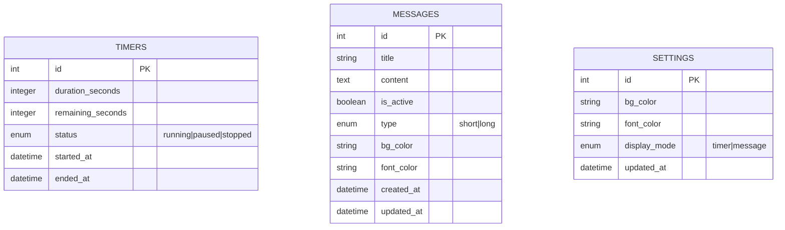

# TimeKeeper Rules Project
- Selalu gunakan bahasa indonesia untuk respons dan penjelasan
- Gunakan Laravel 12 + Livewire + Tailwind 4
- Gunakan pendekatan best practice, keamanan, dan skalabilitas.
- Hindari penggunaan kode redundansi dan duplikat.
- Gunakan teknik caching dan optimasi query database.
- Implementasikan autentikasi pengguna dan kontrol akses.

## 1. Analisis Fitur

* **Halaman Front (untuk Pembicara)**

  * UI 1: countdown timer (menit & detik, huruf besar, jelas).
  * UI 2: pesan panjang full screen.
  * Background & warna teks bisa diubah via color picker.
* **Halaman Admin**

  * CRUD pesan (teks pendek, teks panjang).
  * Set warna background & warna font.
  * Kontrol waktu: mulai, pause, reset.
  * Pilih UI mode: Timer atau Pesan.
* **Penyimpanan**

  * Bisa pakai SQLite (praktis) atau session/localStorage jika tidak mau DB.
  * Untuk fleksibilitas & logging, lebih masuk akal simpan ke SQLite.

---

## 2. ERD (Mermaid Format)



---

## 3. Struktur Migration (Laravel 12)

### Migration `timers`

```php
Schema::create('timers', function (Blueprint $table) {
    $table->id();
    $table->integer('duration_seconds')->default(0);
    $table->integer('remaining_seconds')->default(0);
    $table->enum('status', ['running', 'paused', 'stopped'])->default('stopped');
    $table->timestamp('started_at')->nullable();
    $table->timestamp('ended_at')->nullable();
    $table->timestamps();
});
```

### Migration `messages`

```php
Schema::create('messages', function (Blueprint $table) {
    $table->id();
    $table->string('title')->nullable();
    $table->text('content');
    $table->boolean('is_active')->default(false);
    $table->enum('type', ['short', 'long'])->default('short');
    $table->string('bg_color')->default('#000000');
    $table->string('font_color')->default('#ffffff');
    $table->timestamps();
});
```

### Migration `settings`

```php
Schema::create('settings', function (Blueprint $table) {
    $table->id();
    $table->string('bg_color')->default('#000000');
    $table->string('font_color')->default('#ffffff');
    $table->enum('display_mode', ['timer', 'message'])->default('timer');
    $table->timestamps();
});
```

---

## 4. Struktur Project Laravel (direkomendasikan)

```
app/
  Http/
    Livewire/
      Admin/
        TimerControl.php
        MessageCrud.php
        SettingsForm.php
      Front/
        DisplayTimer.php
        DisplayMessage.php
database/
  migrations/
resources/
  views/
    livewire/
      admin/
        timer-control.blade.php
        message-crud.blade.php
        settings-form.blade.php
      front/
        display-timer.blade.php
        display-message.blade.php
```

---

## 5. Improvement Tambahan

* **Auto sync via Livewire Events** → ketika admin update pesan/waktu, UI front auto berubah tanpa reload.
* **Hotkey Admin** → misal `Space = pause/resume`, `R = reset`, `M = switch to message`.
* **Preset Waktu** → admin bisa simpan preset durasi (misal 10 menit, 15 menit).
* **Notifikasi Warna** → background bisa auto merah jika waktu < 1 menit.

---

